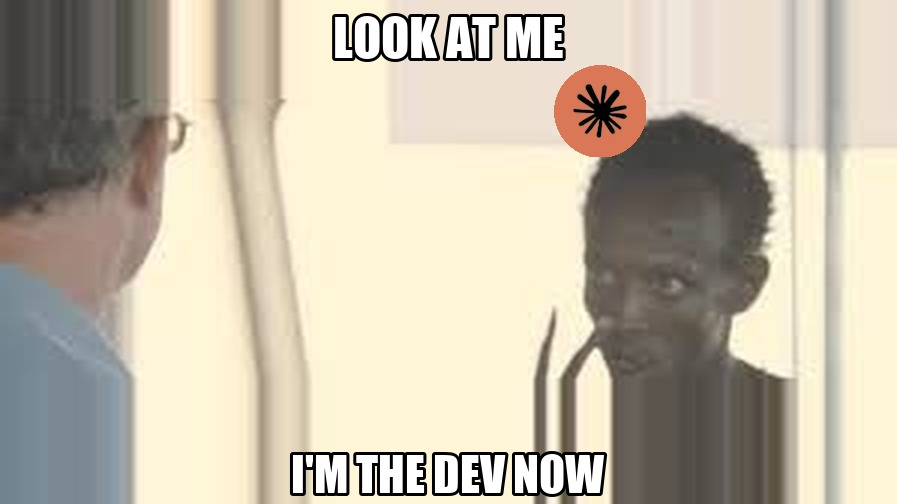

<div align="center">


<br/>



# I am the dev now.

</div>

---

```
git init
git add .
git commit -m "i am the dev now"
git push
```

Previously: confused user.

Now: ships bots, content pipelines, trading algos, tax tools, and school report generators before lunch.

---

**Stack:**
- Python (bots, agents, pipelines)
- Claude Opus 4.6 (the first mate 🤖)
- Buffer API (content distribution)
- Aster Exchange (grid trading)
- Polymarket (weather arb)
- Next.js (incoming)

**Repos:** [@satsxrands](https://github.com/satsxrands)

---

*No hostages were taken in the making of these projects.*
